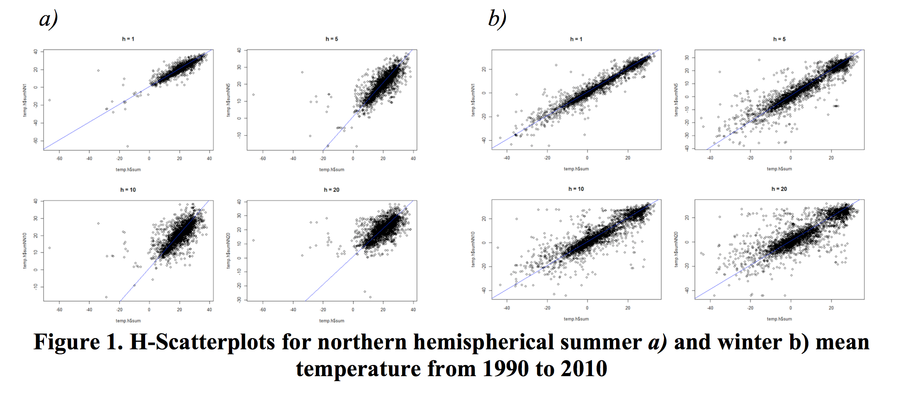
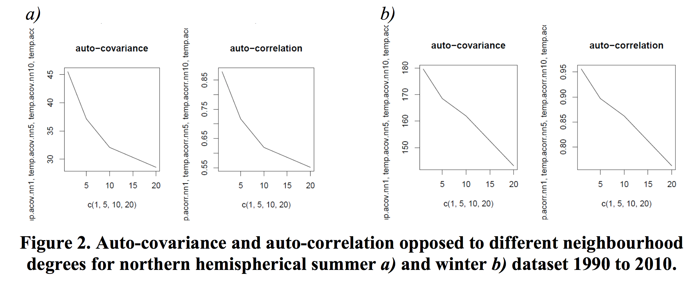
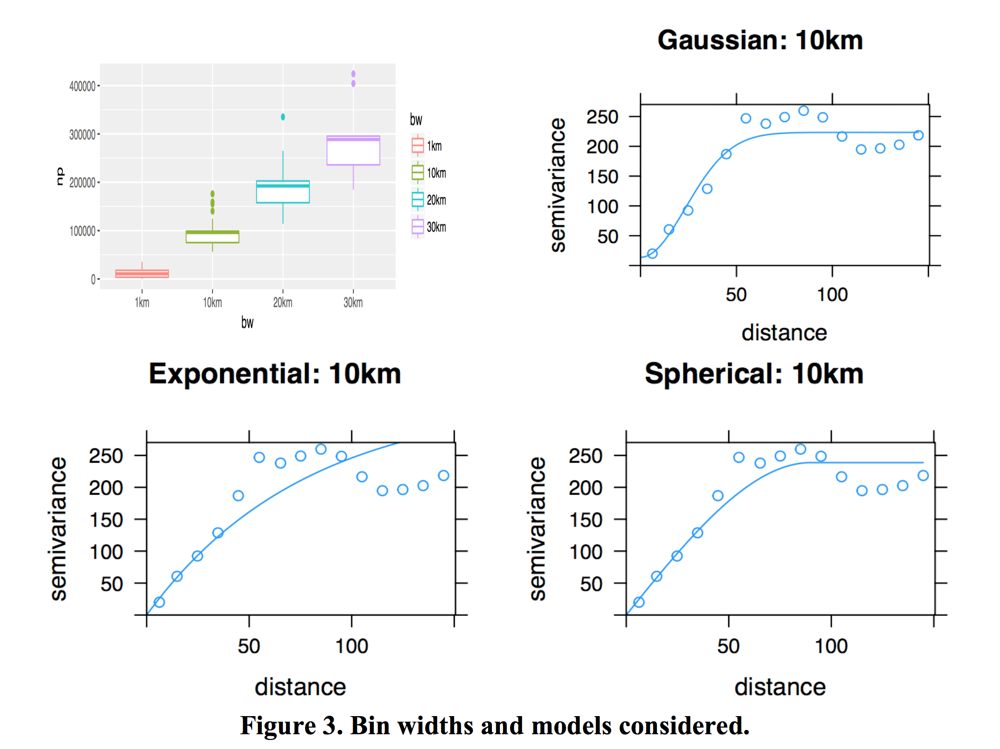
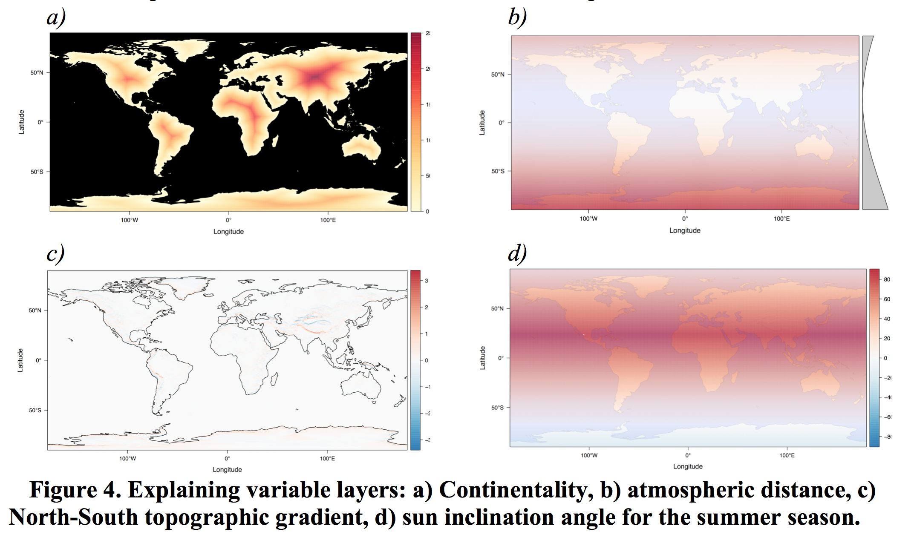
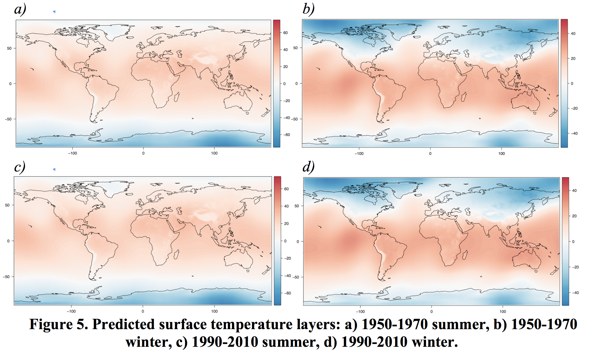
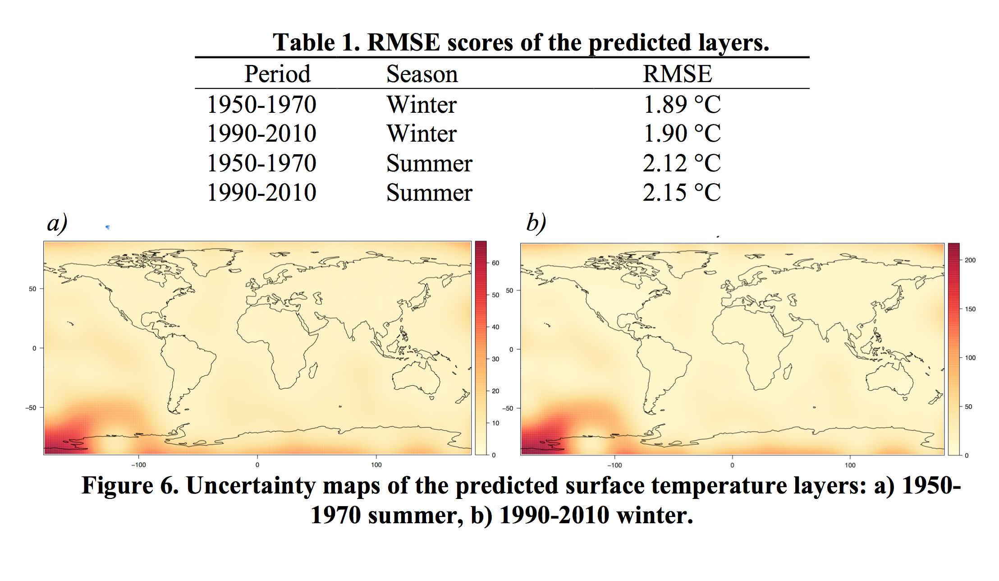
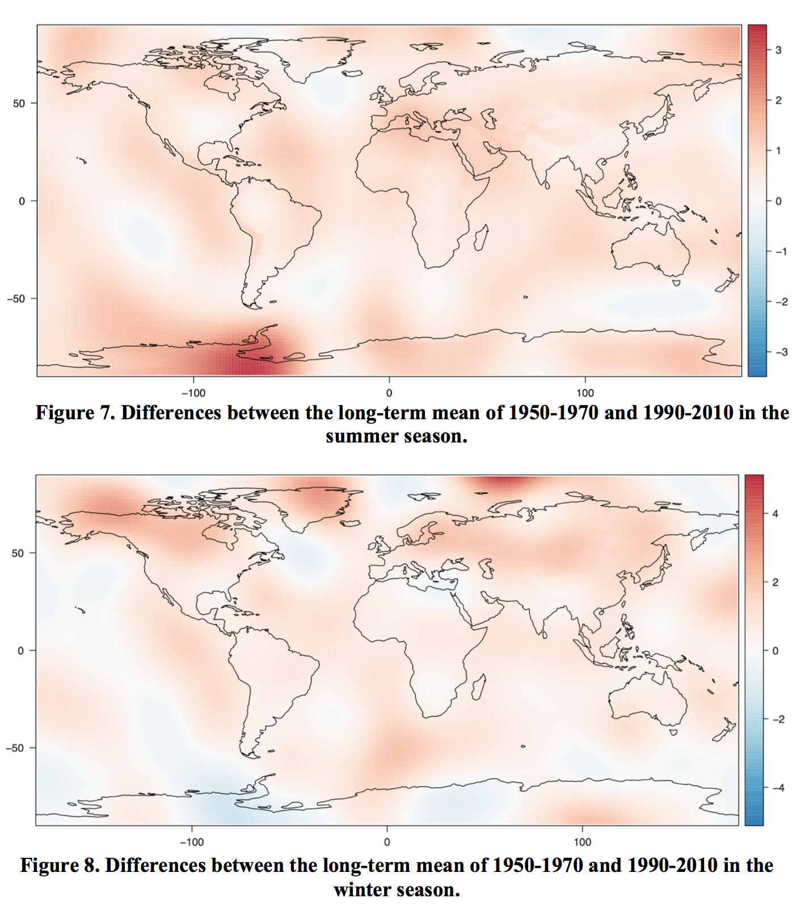

# Introduction
Global warming is considered as a major issue for the further development of the conditions for living organisms on the Earth. In the northern Hemisphere, the warmest 30-year period of the last 1400 years was registered. Globally, the last three decades have been successively warmer than any preceding decade since 1850 (IPCC 2013). In this context, we argue that it is crucial to develop a better understanding of global warming. Since more insights open possibilities to react and adapt to global warming and its implications. By considering the earth system's dynamical complexity, it is unsurprising that global warming is not a spatially even distributed phenomenon, which results in spatial regions that are more affected than others. This is supported by the IPCC report of 2013, where the observed change in surface temperature from 1901-2012 is assessed. Especially regions with large landmasses and mountain regions registered a higher positive change in surface temperature (IPCC 2013).
Analyses of global surface temperature change are conducted by several groups and institutions, which are not necessarily independent, as they often use the same input data. Nevertheless, Hansen et al. (2010) emphasize the advantage of working with the same data as it provides a sort of validation for the different approaches employed by research groups, to overcome data inherent problems such as incomplete spatial and temporal coverage.  
In the context of a semester project we contribute to this research field by presenting a current approach to predict global surface temperatures since 1950 and conduct a change detection. As the global surface temperature steadily increased since the beginning of the 21st century, the data was subset in two datasets, which then were compared to each other regarding seasons. First, we will analyse and discuss the spatial continuity within the data subsets and in a second step we will interpolate global layers for the two periods by using universal Kriging and finally calculate change maps of global warming.

# Methods
## Analysis of spatial continuity in the data
To analyse the spatial continuity of the provided measurements different H-scatterplots with varying values for the parameter h (h = 1, 5, 10, 20) are computed. The parameter h represents the degree of neighbourhood, therefore h = 1 corresponds to the nearest neighbour. Basically, the idea is to analyse how the measurements variate as spatial distance increases between points of measurements. In a second step, the auto-covariance and auto-correlation for each H-scatterplot is computed.
The covariance and the correlation for each neighbourhood is plotted in one auto- covariance and auto-correlation plot. In a last step four different empirical variograms are created with different bin widths (1km, 5km, 10km, 15km) and then plotted to boxplots representing the number of point pairs for each estimate.

## Global surface temperature prediction and change detection
To generate global predictions of the surface temperatures for the summer and winter seasons (time periods of 1950 to 1970 and from 1990 to 2010), a spatial interpolation, based on the universal Kriging approach, is applied on the globally distributed point measurement data. Each measurement point contains four long-term surface temperature means, representing the two periods with two seasons each. To estimate the accuracy of the final global temperature layers, five percent of the data points are scarified and used in hindsight to calculate the root mean squared error (RMSE).  
As interpolation method, universal Kriging is used, which is a combination of ordinary Kriging interpolation and a multivariate linear regression. As in ordinary Kriging, the interpolation is based on a semivariogram, which describes spatial influence of the known neighbouring data points on an unseen location, whose temperature should be predicted. An exponential, Gaussian and spherical model is fitted to the variogram with a bin width that seems to be a good compromise between conservation of the spatial dependency and smoothing the empirical curve enough, to prevent from an overfitting due to outliers. The process of fitting the semivariogram is qualitative and only validated in the end by interpreting the RMSE scores (Pebesma 2004).  
Additionally, to the ordinary Kriging, universal Kriging allows to use further explaining variables for the surface temperature, which are then considered in the process of the prediction of the unseen locations. Therefore, several layers are created from information about the distribution of oceans on the planet, a digital elevation model (DEM) and the geometric relationship of the Earth as a sphere and the sun as a point source of energy. Explaining variables used in the universal Kriging are (i) the elevation, (ii) the continentality – Given by the nearest distance of every land pixel to an ocean, (iii) the atmospheric distance – Defined relatively through the latitude of the pixels and (iv) the sun inclination angle – Determined by the inclination angle specified by the latitude and the North-South gradient of the topography (Haylock et al. 2008).  
The measured data points, the explaining variable layers and the universal Kriging approach are used to predict four global grids, each consisting of 100’000 regularly distributed points. In addition to the predictions, four layers describing the spatial distribution of uncertainty of the predictions are created. To evaluate the quality of the predictions, RMSE scores are calculated at the omitted data point locations (5% of all input data) by comparing the predicted value with the actual measurement. As final step the interpolated layers from the period of 1950-1970 are subtracted from the period of 1990-2010, to obtain two maps of change for the summer and winter season.

# Results
## Spatial continuity
In figure 1, example h-scatterplots are shown, calculated for each data subset. Comparing these four plots, one can see that with an increasing degree of neighbourhood the points increasingly scatters. This supports our suggestion that near points are more related to each other than distant points. In comparison to the summer data set, the winter data set from the same period registered less negative temperatures. The reason for this observation on the one hand might be due to the irregular distribution of landmasses on the earth between the northern and southern hemisphere. Landmasses warm up and cool down faster than surfaces covered by the sea. Therefore, we expect more positive values in northern hemispherical summer than the northern hemispherical winter. On the other hand, the uneven spatial distribution of temperature measurements stations influences the results and the shape of the point clouds.

The observations resulting from the H-Scatterplots are also supported by the corresponding auto-covariance and auto-correlation plots (figure 2). The auto-covariance and the auto-correlation for all data subsets are decreasing with an increasing the neighbourhood degree. As the degree of neighbourhood is related to distance between points, we assume that an increasing neighbourhood degree implicates a greater distance between measurement points. Therefore, measurement stations tend to register similar temperatures compared to more distant measurement stations. Furthermore, the auto-correlation and auto-covariance plots support assumptions made based on the h-scatterplots. The comparison of the summer with the winter season, shows that the correlation and the covariance decrease faster for the summer data sets. This implicates that the rate of change over spatial distance is higher in the summer than in the winter.

## Fitting semivariograms
The bin-width and models used to fit the semivariogram are chosen based on a qualitative assessment of the spatial dependency in the data. Figure 3 shows a boxplot of various bin widths and fitted semivariograms of all the models considered. The semivariogram finally was fitted with a bandwidth of 10km and to a Gaussian model, due to the good compromise between conservation of the spatial dependency and a sufficient smoothing of the empirical curve that prevents from an overfitting.

## Explaining variables
In figure 4 the global explaining variable layers for the summer season are showed. Given through their definition, they are mainly representing derivates from the variable ‘latitude’, but in a more sophisticated and diversified manner. A multivariate linear regression, conducted with the explaining layers to predict the surface temperature, could explain 73 to 85 percent of the variation occurring in the data. The predictions for the winter are more accurate than the predictions for the summer season, while the period seems not to matter.

## Universal Kriging

Figure 5 shows the resulting layers from the universal Kriging and in table 1 the corresponding RMSE scores for five percent of the input data are listed. The validation conducted by calculating RMSE scores is considering the location of the prediction of the raster cell in which the validation data point is located and not the exact position of the data point itself. This means that the scores might be better for the actual prediction model, but we are mainly interested in evaluating and assessing the quality of the global raster layer, which is better represented by the RMSE scores below.

## Difference images

# Conclusion
By comparing the interpolated surface temperature maps during the northern hemispherical winter and summer between 1950-1970 and 1990-2010, we found that surface temperature especially increased during the northern hemispherical summer months. The interpolated maps show that the hemispheres are not affected equally. The rate of change is larger for the northern hemisphere than the southern. Especially the northern hemispherical summers underwent an increase in surface temperature, comparing the time periods of 1950-1970 and 1990-2010. These findings are also supported by our spatial continuity analysis. We found that during the northern hemispherical summer more positive temperatures were registered. The cause for these results might on the one hand that the northern hemisphere has larger areas covered by land than the southern hemisphere. On the other hand, the measurements were not collected spatially even distributed. We think that because of accessibility problems and information flow in the past most measurements stations were built on land. This would explain why we noticed more measurement stations in the northern hemisphere in our dataset. This could have influenced our results and conclusions drawn from them.  
Nevertheless, in comparison to the IPCC (2013) report and their map of observed change in surface temperature from 1901-2012, similar results were achieved. The IPCC (2013) derived their map from temperature trends determined by linear regression models from one dataset. The map shows also a surface temperature increase, especially on the Eurasian landmass and in north America. Additionally, our interpolated change map for the northern hemispherical summer shows a similar magnitude of temperature increase as the IPCC (2013) has observed. Hansen et al. (2010) presented seasonal surface temperature changes (1950- 2009) based on linear trends. Their maps show in contrast to our results a higher increase of temperature during the northern hemispherical winter, especially on the Eurasian landmass. This difference might be occurring due to the elevation model included in our interpolation.  

In summary, universal Kriging offers a promising approach for estimating reliable global surface temperature maps, which allow an assessment of the distribution of global warming.

# References
Hansen, J., Ruedy, R., Sato, M., & Lo, K., 2010. Global surface temperature change. Review of Geophysics, 48, pp.1–29.

Haylock, M. R., Hofstra, N., Klein Tank, A. M. G., Klok, E. J., Jones, P. D., & New, M. (2008). A European daily high-resolution gridded data set of surface temperature and precipitation for 1950–2006. Journal of Geophysical Research, pp.1–12.

IPCC, 2013. Summary fo Policymakers. Climate Change 2013: The Physical Science Basis.Contribution of Working Group I to the Fifth Assessment Report of the Intergovernmental Panel on Climate Change, pp.1–28.

Pebesma, E. J. (2004). Multivariable geostatistics in S: The gstat package. Computers and Geosciences, 30(7), pp.683–691.
